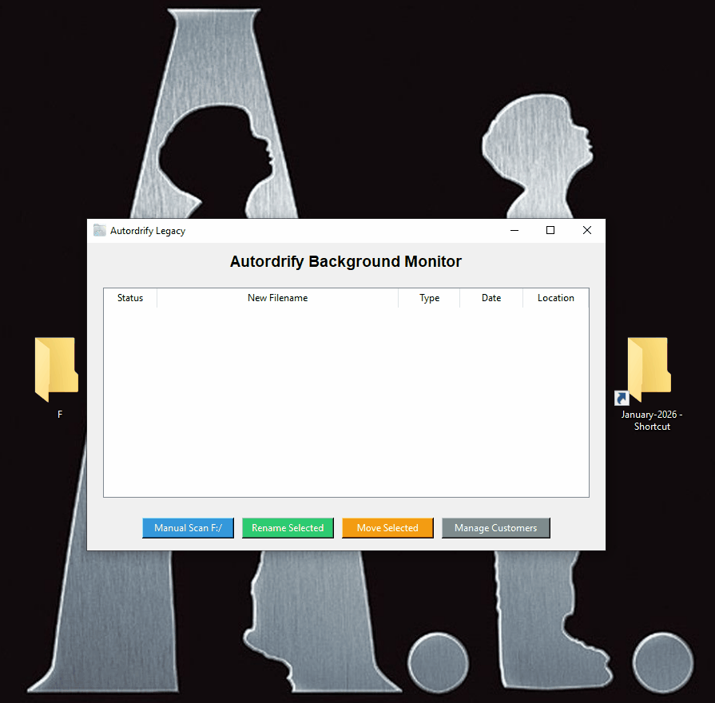

# 📂 Autordrify: Intelligent PDF Automation & Organization Tool

> **A custom Desktop Application (GUI) that eliminates manual data entry by automatically detecting, renaming, and filing invoices.**

---

## 📸 See It In Action

*(The bot detects the file, identifies the customer, and renames it—hands-free.)*

---

## 🚀 The Business Problem
For many businesses, managing incoming invoices and order files is a chaotic, manual process. Staff members spend hours every week:
1.  **Opening PDFs** just to see who the customer is.
2.  **Manually renaming** files (often making typos).
3.  **Moving files** to specific folders on a server.

**This manual workflow causes lost files, billing delays, and hundreds of wasted hours per year.**

## 💡 The Solution: Autordrify
**Autordrify** is a "Set-it-and-Forget-it" desktop automation tool built with Python.

It acts as a 24/7 digital assistant that watches your Downloads folder. As soon as a PDF arrives, Autordrify wakes up, reads the content using OCR technology, matches it against your customer database, and instantly organizes the file to the correct location—renaming it perfectly every time.

---

## ✨ Key Features

### 1. 👁️ Real-Time Background Monitoring
* Utilizes the `Watchdog` library to detect new files the millisecond they land in your folder.
* No need to click "Run" or "Refresh"—it works silently in the background.

### 2. 🧠 Smart Content Parsing
* Opens PDFs programmatically using `pdfplumber`.
* Scans document text to identify unique Customer IDs or names.
* Cross-references data with a secured `customers.txt` database.

### 3. 🖥️ User-Friendly GUI (Tkinter)
* Fully functional Desktop Interface (not just a command-line script).
* Start/Stop buttons for full user control.
* Live "Activity Log" that shows the user exactly what the bot is doing in real-time.

### 4. 🗂️ Intelligent Filing System
* Automatically renames files to a standardized format (e.g., `CustomerName_Date_Invoice.pdf`).
* Moves files to network drives or specific project folders automatically.

---

## 🛠️ Tech Stack
* **Language:** Python 3.10+
* **GUI Framework:** Tkinter (CustomTkinter styles)
* **Automation:** Watchdog (File System Events)
* **PDF Processing:** pdfplumber
* **Packaging:** PyInstaller (Compiled to .exe for Windows)

---

## 🔧 Installation & Setup

1.  **Clone the Repository**
    ```bash
    git clone [https://github.com/Ali-Shehbaz/Autordrify-Desktop-App.git](https://github.com/Ali-Shehbaz/Autordrify-Desktop-App.git)
    ```
2.  **Install Dependencies**
    ```bash
    pip install -r requirements.txt
    ```
3.  **Configure Customers**
    * Rename `customers_sample.txt` to `customers.txt`.
    * Add your customer keywords.
4.  **Run the App**
    ```bash
    python src/main.py
    ```

---
*Created by Ali Shehbaz – Open to Freelance Automation Projects.*